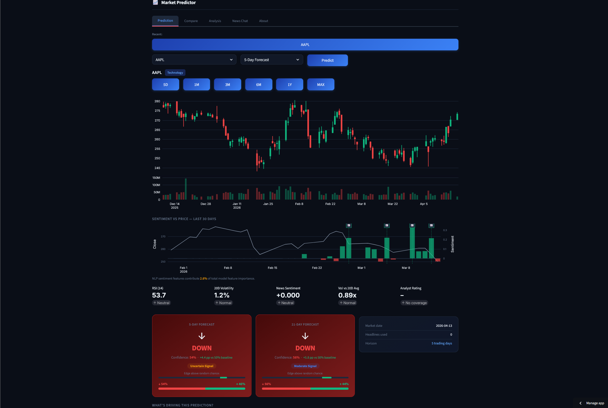
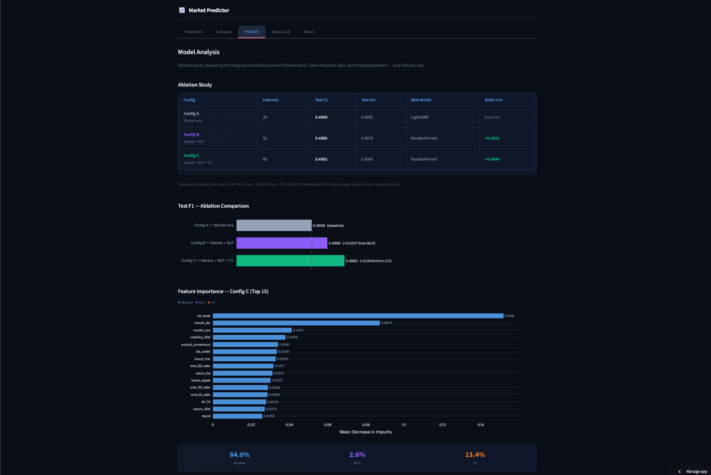
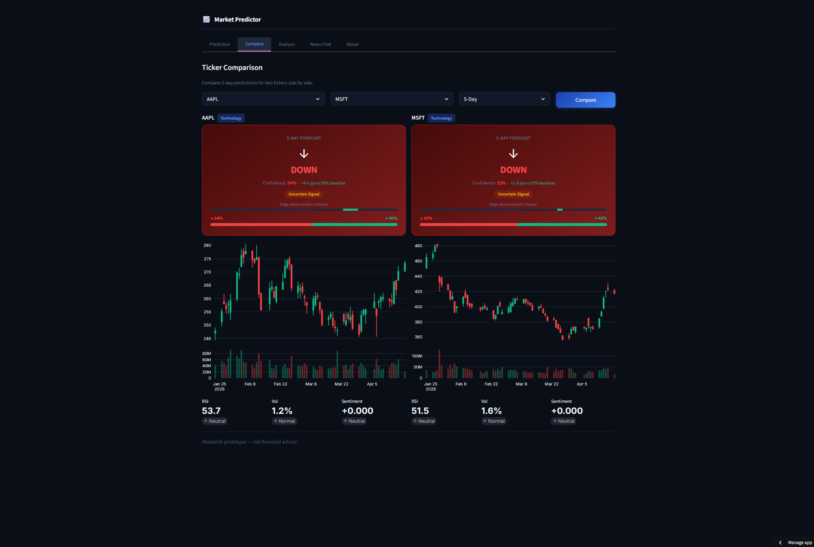

# Financial Market Predictor

An end-to-end AI application that predicts **5-day stock price direction (UP/DOWN)** for 67 S&P 500 stocks by fusing three complementary signal sources: structured market data (ML), financial news sentiment (NLP), and candlestick chart pattern recognition (CV).

> **Disclaimer:** Research prototype — not financial advice.

**Live Demo:** [financial-market-predictorr.streamlit.app](https://financial-market-predictorr.streamlit.app/)

---

## Screenshots

| Prediction | Model Analysis | NLP + CV |
|:---:|:---:|:---:|
|  |  |  |

---

## What it does

The system tests the hypothesis that combining three independent "views" of the market — technical indicators, language-based sentiment, and visual chart patterns — yields more robust predictions than any single modality alone. An ablation study (Configs A → B → C) quantifies each block's incremental contribution on a held-out 2025 test set.

**Streamlit app includes:**
- Live predictions for any of the 67 tracked tickers
- Interactive Plotly candlestick charts
- Ablation results and per-block feature importance
- RAG-powered news Q&A chatbot

---

## Key Results

All models evaluated on held-out **2025 test data** (temporal split, no leakage).

| Config | Features | # Features | Best Model | CV F1 ± std | Test F1 | Test Acc | Δ vs Baseline |
|--------|----------|-----------|------------|:-----------:|:-------:|:--------:|:-------------:|
| **A** | Market only | 28 | LightGBM | 0.509 ± 0.016 | **0.4970** | **0.4971** | — |
| **B** | Market + NLP | 56 | LightGBM | 0.510 ± 0.027 | 0.4826 | 0.4842 | -0.0143 |
| **C** | Market + NLP + CV | 66 | LightGBM | 0.511 ± 0.018 | 0.4861 | 0.4863 | -0.0109 |

**Interpretation:** ~0.50 F1 remains a realistic ceiling for direction prediction on public data — consistent with the semi-strong Efficient Market Hypothesis. In this latest run, Config A is strongest on test; NLP and CV remain valuable as integrated modalities and interaction channels, but do not improve headline test F1 in this split.

**Selection protocol:** Best model per config is chosen by **validation F1 only** (2024H2). The **test set (2025)** is evaluated once for final reporting.

| Modality | Contribution | Why it works |
|----------|-------------|--------------|
| Market (ML) | Baseline | Technical indicators capture momentum, volatility, mean-reversion regimes |
| NLP | -0.0143 F1 vs A | Sentiment *changes* can lead price, but coverage remains sparse even with fallback |
| CV | -0.0109 F1 vs A (+0.0035 vs B) | Fine-tuned EfficientNet-B0 captures visual patterns complementary to indicators; in this run the net effect remains below baseline A |

### Multi-Horizon Comparison

The app also supports a **21-day prediction horizon** (Config C equivalent, 61 features), evaluated on the same held-out 2025 test set:

| Horizon | Features | Test F1 | Test Acc | Test Rows |
|---------|----------|:-------:|:--------:|:---------:|
| **5-day** | 66 (Config C) | **0.4861** | 0.4863 | 20,033 |
| **21-day** | 61 (Config C) | 0.4961 | 0.4989 | 18,961 |

**Finding:** The EMH ceiling (~0.50 F1) holds consistently across both prediction horizons, confirming that the signal limitation is structural rather than specific to the 5-day window. The 21-day model offers slightly higher recall on DOWN predictions (0.65 vs 0.59), suggesting chart patterns carry more signal over longer windows.
**Note:** 5-day numbers reflect the validation-based selection protocol update; re-train the 21-day model to align metrics if required.

### Model Selection Protocol

Model selection is performed **exclusively on the validation set (2024H2)** using `val_f1_macro` as the selection metric — the test set (2025) is never seen during training or hyperparameter search.

| Step | Data split | Purpose |
|------|------------|---------|
| 5-fold TimeSeriesSplit | Train ≤ 2024-06 | Cross-validated F1 to guide Optuna trials |
| Val 2024H2 | 2024-07 – 2024-12 | **Model selection** (`selection_metric = val_f1_macro`) |
| Test 2025 | 2025-01 – 2025-12 | **Final evaluation — evaluated exactly once** |

Evidence: `data/processed/ablation_results.json` records `selection_metric: "val_f1_macro"` for Configs A, B, and C. No test-set information is used to pick or tune any model.

---

## Architecture

```
DATA COLLECTION
├── Yahoo Finance → OHLCV (69 CSV files, 67 tickers + 2 indices)
├── RSS / NewsAPI  → Financial headlines (8,552 rows across 67 tickers)
└── mplfinance    → Candlestick chart images (61,640+ PNGs, bi-daily)

FEATURE EXTRACTION
├── Market block  : 28 technical indicators + sector encoding       → 28 features
├── NLP block     : FinBERT + VADER + embedding PCA + analyst data  → 28 features
└── CV block      : Fine-tuned EfficientNet-B0 → 1280-dim → PCA    → 10 features

UNIFIED FEATURE MATRIX (per ticker-date)
├── Config A: 28 features  (market only)
├── Config B: 56 features  (+ NLP)
└── Config C: 66 features  (+ CV)      ← full multimodal configuration

MODEL TRAINING (identical split across all configs)
├── RandomForest       (GridSearch-tuned)
├── LightGBM           (Optuna, 40 trials)
└── StackingClassifier (RF + XGB + LGB meta-ensemble)
    5-fold TimeSeriesSplit · Train ≤ 2024-06, Val 2024H2, Test 2025

STREAMLIT APP
└── Live predictions · Ablation analysis · RAG news chatbot
```

---

## Project Structure

```
financial-market-predictor/
├── app.py                          # Streamlit entry point
├── requirements.txt
├── .env.example                    # API key template
├── src/
│   ├── config.py                   # Central config (paths, tickers, hyperparameters)
│   ├── app/
│   │   ├── pages/
│   │   │   ├── predictor.py        # Live prediction UI (Plotly charts + cards)
│   │   │   ├── model_analysis.py   # Ablation results and feature importance
│   │   │   ├── rag_chat.py         # RAG news Q&A chatbot
│   │   │   └── about.py            # Project overview page
│   │   └── utils.py                # Cached loaders and UI helpers
│   ├── data_collection/
│   │   ├── market_collector.py     # Yahoo Finance OHLCV downloader
│   │   ├── news_scraper.py         # RSS + NewsAPI headline scraper
│   │   └── chart_generator.py      # mplfinance candlestick image generator
│   ├── features/
│   │   ├── market_features.py      # 28 technical indicators + target
│   │   ├── nlp_features.py         # FinBERT/VADER sentiment + sector fallback
│   │   └── cv_features.py          # EfficientNet-B0 embeddings + PCA
│   ├── cv/
│   │   └── chart_classifier.py     # EfficientNet-B0 feature extractor
│   ├── models/
│   │   ├── train_ml.py             # Ablation training pipeline
│   │   ├── predict.py              # LivePredictor (inference)
│   │   └── evaluate.py             # Evaluation visualizations
│   └── nlp/
│       ├── finbert_sentiment.py    # FinBERT sentiment pipeline
│       ├── vader_sentiment.py      # VADER lexicon pipeline
│       └── rag_chatbot.py          # Retrieval-augmented Q&A
├── notebooks/                      # Development records (v1 exploratory phase)
│   ├── 01_eda.ipynb                # Exploratory data analysis
│   ├── 02_ml_baseline.ipynb        # Feature engineering and baseline (3-class, 28 features)
│   ├── 03_nlp_pipeline.ipynb       # NLP sentiment extraction
│   ├── 04_cv_pipeline.ipynb        # Chart embeddings (EfficientNet + PCA)
│   ├── 05_integrated_model.ipynb   # End-to-end Config A/B/C training (3-class)
│   └── 06_evaluation_ablation.ipynb # Full ablation study and error analysis
├── scripts/
│   ├── finetune_cnn.py             # Domain-adapt EfficientNet-B0 on chart labels
│   └── train_21d.py                # 21-day horizon model training
├── data/
│   ├── raw/                        # market_data/, news/, charts/ (gitignored — too large)
│   └── processed/                  # Feature parquets + ablation results
├── models/                         # Saved model artifacts (pkl + pth, tracked in git)
└── tests/                          # pytest test suite
```

---

## Feature Summary

### Market Block (28 features)
Returns (1d/5d/20d), RSI-14, MACD (line/signal/histogram), SMA-20/SMA-50/EMA-12 ratios, Bollinger Bands (upper/lower/width), ATR-14, 20-day volatility, volume ratio, VIX level, day-of-week and month cyclical encoding (sin/cos), sector one-hot dummies.

### NLP Block (28 features)
FinBERT compound score + confidence, VADER compound score, news volume (1d/5d rolling), headline length, 10 FinBERT embedding PCA components, sentiment momentum, sentiment dispersion, 3-day sentiment shift, sentiment surprise (z-score vs 20-day baseline), sentiment × volume interaction, news volume z-score, imputation flag. Plus 5 analyst-data features: analyst consensus score, analyst coverage count, sentiment momentum from analyst revisions, upgrade/downgrade score, price target upside.

**Coverage strategy:** ticker-level → sector-average fallback → market-average fallback → forward-fill. Raises raw 1.7% coverage to ~59%.

### CV Block (10 features)
10 PCA components from 1280-dim EfficientNet-B0 embeddings. Model fine-tuned on chart→direction labels (`scripts/finetune_cnn.py`) rather than using frozen ImageNet weights — this was the key step enabling a positive CV contribution.

---

## Data Sources

| Source | Type | Scale |
|--------|------|-------|
| **Yahoo Finance** (yfinance) | OHLCV + VIX | 67 tickers + 2 indices, 2020–2026 |
| **RSS feeds + NewsAPI** | Reuters, MarketWatch, Yahoo Finance headlines | 8,552 scraped rows across 67 tickers |
| **ProsusAI/finbert** | Pre-trained financial sentiment model | HuggingFace Hub |
| **EfficientNet-B0** | CNN backbone (torchvision) → domain fine-tuned | 61,640 generated chart images |

---

## Dataset — Ticker Selection

The 67 S&P 500 tickers were chosen by four criteria applied in combination:

| Criterion | Threshold | Rationale |
|-----------|-----------|-----------|
| **Liquidity** | Average daily volume > 1 M shares | Avoids illiquid names where indicators become noisy |
| **Sector diversity** | 7 GICS sectors represented | Prevents sector-specific overfitting; enables sector error analysis |
| **Market capitalisation** | Large-cap only | Ensures consistent news coverage and analyst attention |
| **Data availability** | Continuous OHLCV history since 2020 | Provides ≥ 4 years for the temporal train / val / test split |

**Deliberate exclusions:**
- **Small-caps:** insufficient news coverage causes NLP features to be entirely imputed rather than informative
- **Recently listed tickers (post-2021 IPOs):** too short a history to populate the 5-fold training window reliably

## NLP Approach Comparison

| Approach | Type | Strengths | Role |
|----------|------|-----------|------|
| VADER | Lexicon/rule-based | Fast, deterministic, robust on short headlines | Baseline signal + fallback |
| FinBERT | Transformer (finance-tuned) | Finance-domain context on earnings/macro language | Primary sentiment + confidence features |
| FinBERT + VADER combined | Ensemble feature fusion | More stable across coverage gaps | Final NLP feature block (Config B/C) |

---

## Development Journey

The initial version reached F1 = 0.34 across three classes (UP/DOWN/SIDEWAYS) on a next-day horizon — barely above random. Seven root-cause fixes drove the final result:

| Phase | Change | Why |
|-------|--------|-----|
| 1 | 3-class next-day → 5-day binary | Doubles signal-to-noise; removes ill-defined SIDEWAYS band (60%+ of data) |
| 2 | NLP fallback strategy | Raw 1.7% coverage makes NLP features a no-op; sector/market fallback gets to 59% |
| 3 | Chart generation: monthly → bi-daily | 1.7% CV coverage → 59%; 2,788 → 61,640 images |
| 4 | LightGBM + Optuna + Stacking | Single default RF leaves F1 on the table; multi-model comparison removes selection bias |
| 5 | `st.cache_resource` / `st.cache_data` | App reloaded models on every click; now <3s after initial load |
| 6 | Plotly dark-theme UI | matplotlib line charts + default Streamlit styling; replaced with interactive financial dashboard |
| 7 | CNN fine-tuning + RAG chatbot | Frozen ImageNet weights caused CV regression; domain adaptation on chart→direction labels turned it positive |

---

## Notebook vs. Production Pipeline

The notebooks (`01`–`06`) document the **iterative development process** and contain saved outputs from the exploratory phase (v1: 3-class UP/DOWN/SIDEWAYS, 28 features, F1≈0.34). The production pipeline in `src/` implements the final version (v2: binary UP/DOWN, 28–66 features depending on config, F1≈0.50). The key changes are captured in the [Development Journey](#development-journey) section above. Both versions are intentionally preserved to show the full research arc.

---

## Local Setup

### Prerequisites
- Python 3.11+
- ~10 GB disk space (charts + embeddings)
- GPU optional (CPU inference works; CNN batch takes ~30 min)

### Installation

```bash
git clone https://github.com/Scampoloni/financial-market-predictor.git
cd financial-market-predictor
python -m venv .venv
source .venv/bin/activate        # Windows: .venv\Scripts\activate
pip install -r requirements.txt
cp .env.example .env             # add NEWS_API_KEY and optionally GEMINI_API_KEY
```

### Run the full pipeline

```bash
# 1. Download market data (OHLCV)
python -m src.data_collection.market_collector

# 2. Scrape news headlines
python -m src.data_collection.news_scraper

# 3. Build market features
python -m src.features.market_features

# 4. Build NLP features (FinBERT + VADER + PCA)
python -m src.features.nlp_features

# 5. Generate candlestick charts (bi-daily)
python -m src.data_collection.chart_generator --step 2

# 6. Build CV features (EfficientNet + PCA)
python -m src.features.cv_features

# 7. Train models + run ablation study
python -m src.models.train_ml

# 8. (Optional) Fine-tune EfficientNet-B0 on chart labels
python scripts/finetune_cnn.py --epochs 10

# 9. Launch the app
streamlit run app.py
```

### Tests

```bash
pytest tests/ -q
```

### Smoke-test dataset (reproducible end-to-end run)

For a fast, fully reproducible run **without any downloads**, use the bundled smoke dataset.
It covers **3 tickers (AAPL, MSFT, NVDA) + 2 indices**, ~3 months of market data, and a small
corpus of news headlines — enough to exercise the entire feature-to-training pipeline in minutes
rather than hours.

**What the smoke run produces:**
- `data/processed/features_market_smoke.parquet` — 28-feature market block for the 3 tickers
- `data/processed/features_nlp_smoke.parquet` — 24-feature NLP block
- `data/processed/features_cv_smoke.parquet` — 10 PCA CV embeddings
- `models/lgbm_config_C_smoke.pkl` — a trained LightGBM Config C model (not production quality)

```bash
# Build smoke dataset from current raw data (one-time, already done in the repo)
python scripts/build_smoke_dataset.py

# Activate smoke dataset (backs up data/raw to data/raw_full)
python scripts/use_smoke_data.py --activate

# Run the smoke pipeline (~5–10 minutes on CPU)
python -m src.features.market_features --test
python -m src.features.nlp_features --test
python -m src.data_collection.chart_generator --test --step 2
python -m src.features.cv_features --test
python -m src.models.train_ml --config C

# Restore full dataset
python scripts/use_smoke_data.py --restore
```

---

## Tech Stack

| Layer | Libraries |
|-------|-----------|
| ML | scikit-learn, LightGBM, XGBoost, Optuna |
| NLP | HuggingFace Transformers (FinBERT), NLTK (VADER), sentence-transformers (RAG) |
| CV | PyTorch, torchvision (EfficientNet-B0) |
| Data | pandas, numpy, pyarrow, yfinance, feedparser |
| Visualization | Plotly, matplotlib, mplfinance |
| App | Streamlit |
| Evaluation | SHAP, pytest |

---

## Ethics & Limitations

> **This is a research prototype. It is not a financial adviser, not a trading signal, and must never be used for real capital allocation.**

### Data Bias
- **English-only sources:** all news inputs come from English-language RSS feeds and NewsAPI, dominated by US financial media (Reuters, MarketWatch, Yahoo Finance). Non-English coverage of the same companies is invisible to the model, which may distort sentiment for companies with significant international operations.
- **Source concentration:** a small number of high-volume feeds account for most headlines. Sentiment shifts driven by niche or regional outlets are under-represented.
- **Survivorship bias:** the ticker universe consists of currently-listed S&P 500 constituents. Companies that were delisted or went private between 2020 and 2026 are absent, biasing results toward historically successful firms.

### Self-Fulfilling Prophecy Risk
If a system like this were deployed at scale, consistent buy/sell signals from many users acting simultaneously could move prices in the predicted direction — not because the model is accurate, but because of coordinated action. This feedback loop would corrupt any future evaluation and could amplify market volatility rather than reflect it.

### Market Access Inequality
- Institutional investors operate with lower-latency data feeds, proprietary alternative data, and larger compute budgets than the sources used here. Any edge captured by this model is likely already arbitraged away at the institutional level.
- Retail investors who act on model predictions without understanding its ~50% accuracy and the EMH context could incur losses.

### Additional Limitations
- **Accuracy ceiling:** ~0.50 F1 on direction prediction is consistent with the semi-strong Efficient Market Hypothesis; public information is largely priced in by the time it enters this pipeline.
- **Survivorship bias in evaluation:** the 2025 test set only includes tickers that survived and remained in the S&P 500, which may overstate reliability.
- Past performance on the held-out 2025 test set does not guarantee future performance.

---

## Submission Evidence

- GitHub repository: https://github.com/Scampoloni/financial-market-predictor
- Live deployment URL: https://financial-market-predictorr.streamlit.app/
- Filled documentation template: `docs/PROJECT_DOCUMENTATION_TEMPLATE_FILLED.md`
- Requirements matrix (A-E): `docs/AE_REQUIREMENTS_MATRIX.md`
- Final submission runbook: `docs/FINAL_SUBMISSION_RUNBOOK.md`
- Final checklist: `ABGABE-CHECKLISTE.md`

Submission-specific credentials (if any) must be submitted separately (e.g., Moodle) and must not be committed.
