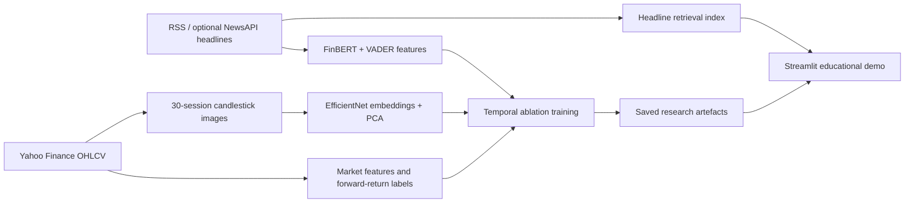

# Financial Market Direction Research

> An AI-assisted research prototype evaluating whether technical market data, financial-news sentiment, and candlestick-image features improve short-horizon equity-direction classification.

> **Key takeaway:** an audited A/B rerun found no robust 5-day directional value: Market-only reached macro F1 0.4918 and Market + NLP 0.4887 in the reporting period. This project demonstrates an end-to-end applied research workflow and the difficulty of finding short-horizon signals in public data; it is not a profitable prediction system.

**Research prototype only.** This project is not a trading system and does not provide investment, financial, or trading advice. Historical outputs do not imply future performance.

## At a glance

| Question | What was investigated |
| --- | --- |
| Research question | Do public market, headline-sentiment, and chart-image features improve 5- or 21-trading-day direction classification? |
| Universe | 67 large-cap US equities across seven sectors, plus market context data |
| Core workflow | Collect -> engineer features -> temporally validate -> compare feature blocks -> serve an educational demo |
| Primary metric | Macro F1, supported by accuracy and per-class precision/recall |
| Central finding | The audited A/B rerun did not demonstrate robust directional predictability or an NLP improvement over market-only features. |

## Demo status

The Streamlit application is an educational interface for inspecting legacy experimental artefacts and generating an **experimental direction estimate** from live market inputs. Its model confidence is not calibrated and must not be used for decisions. The separate news Q&A feature searches the bundled headline index; public demo mode does not fetch live news or call a paid LLM API.

The historic deployment link is [financial-market-predictorr.streamlit.app](https://financial-market-predictorr.streamlit.app/). Verify it manually before linking it from a CV: deployment state and artefact freshness can change independently of this repository.

| Estimate interface | Analysis interface | NLP/CV interface |
| :---: | :---: | :---: |
|  |  |  |

## System overview


```mermaid
flowchart LR
    A[Yahoo Finance OHLCV] --> B[Market features and forward-return labels]
    C[RSS / optional NewsAPI headlines] --> D[FinBERT + VADER features]
    A --> E[30-session candlestick images]
    E --> F[EfficientNet embeddings + PCA]
    B --> G[Temporal ablation training]
    D --> G
    F --> G
    G --> H[Saved research artefacts]
    H --> I[Streamlit educational demo]
    C --> J[Headline retrieval index]
    J --> I
```

## Data and modalities

- **Market:** OHLCV data collected through `yfinance`, technical indicators, calendar features, sector dummies, and VIX context.
- **NLP:** FinBERT financial-sentiment scores, VADER scores, headline volume, and PCA-reduced FinBERT embeddings. Direct ticker-news coverage is sparse; sector/market fallbacks and forward filling increase row completeness, but do **not** create direct news information.
- **Computer vision:** 30-trading-day candlestick images ending at the prediction timestamp; EfficientNet-B0 embeddings are compressed to ten PCA components.
- **Analyst data:** the repository can construct analyst features from `yfinance`, but current aggregate recommendation and price-target values are not a verified point-in-time historical source. They are excluded from any validity claim.

See [data-card.md](docs/data-card.md) for source, missingness, and licensing considerations.

## Experimental design

The target is the sign of the close-to-close forward return after 5 or 21 trading days (`UP` if positive; otherwise `DOWN`). Features are intended to be available at the daily close. Chart windows end on that date and do not include target-period candles.

The revised training code uses chronological train, validation, and reporting partitions, purges the forward-label horizon at boundaries, applies `TEST_END`, and uses date-grouped expanding folds with an embargo. This prevents rows for different tickers on one session from being split across a fold.

The saved legacy artefacts pre-date this cleanup. A and B were rerun with the revised purged protocol and are stored separately with source hashes and prediction rows. C still requires the same rerun; D remains invalid for historical evaluation because it uses non-point-in-time analyst data. The reporting period was previously inspected during project development, so this is an audited reporting evaluation—not a claim that the period was evaluated exactly once.

Details: [methodology.md](docs/methodology.md) and [leakage-audit.md](docs/leakage-audit.md).

## Audited A/B reporting results

`data/processed/rerun_purged_ab_results.json` and `rerun_purged_ab_predictions.parquet` record an A/B run at commit `7702dd3`. Both configurations used 72,159 training rows, 8,308 validation rows, and 20,033 reporting rows. The reporting rows span 2025-01-02 to 2026-03-13; the configured end was purged by five business days for the forward label.

| Configuration | Feature blocks | Selected model | Macro F1 | Accuracy | Balanced accuracy | Comparison |
| --- | --- | --- | ---: | ---: | ---: | --- |
| A | Market only | LightGBM | 0.4918 | 0.4920 | 0.4935 | Below simple 5-day momentum (0.4962 macro F1). |
| B | Market + NLP | LightGBM | 0.4887 | 0.4888 | 0.4931 | Below A by 0.0031 macro F1. |

For context, the majority-class baseline scored 0.3506 macro F1 because the reporting class balance was 54.0% UP / 46.0% DOWN. One seeded stratified-random draw scored 0.4982 macro F1; it is shown as a diagnostic, not a stable benchmark estimate. The saved prediction rows reproduce every reported A/B metric.

These results do not support a claim that the NLP block adds predictive value. They are consistent with the difficulty of extracting public-data signals at this horizon, but do not prove market efficiency or absence of any signal.

## Legacy results: diagnostic only

The existing `data/processed/ablation_results.json` contains the following 5-day diagnostic outputs. They are shown for transparency, not as validated performance claims.

| Configuration | Feature blocks | Stored macro F1 | Interpretation |
| --- | --- | ---: | --- |
| A | Market only | 0.4970 | Superseded by the audited A rerun above. |
| B | Market + NLP + analyst | 0.4826 | Superseded; the legacy B definition improperly included analyst columns. |
| C | Market + NLP + CV | 0.4861 | Below A in this legacy run; rerun required. |
| D | C + analyst | 0.4850 | Methodologically invalid for historical reporting because aggregate analyst data is current. |

The observed pattern is consistent with the difficulty of extracting short-horizon signals from public data. It does not establish profitability, alpha, a universal performance ceiling, market efficiency, or the usefulness of a modality.

## Architecture and technologies

| Area | Used technologies |
| --- | --- |
| Data and analysis | Python, pandas, NumPy, yfinance, pyarrow |
| ML and evaluation | scikit-learn, LightGBM, Optuna, pytest |
| NLP | Hugging Face Transformers, ProsusAI/FinBERT, NLTK/VADER, sentence-transformers |
| Computer vision | PyTorch, torchvision, EfficientNet-B0, mplfinance |
| Application | Streamlit, Plotly |
| News Q&A | Local vector retrieval, optional Anthropic Claude or OpenAI generation; not Gemini |

FinBERT is implemented as a feature pipeline. Candlestick images and EfficientNet embeddings are implemented. The news Q&A component is separate from the classification pipeline, uses Claude/OpenAI only when an environment key is configured, and displays retrieved headlines. It is not a Gemini RAG feature and should not be described as part of prediction.

## Reproducibility

### Lightweight inspection

The tracked artefacts and tests support local inspection without downloading data or calling external APIs.

```powershell
python -m venv .venv
.\.venv\Scripts\Activate.ps1
pip install -r requirements.txt
pytest tests -q
ruff check src tests scripts app.py
streamlit run app.py
```

### Full research rerun

Full reproduction needs data collection, FinBERT processing, chart generation, CNN embedding extraction, and model training. It can take hours and requires meaningful local storage and compute. Do not expect it to be a quick or byte-identical command sequence: external data, model versions, and data-provider availability can change.

```powershell
python -m src.data_collection.market_collector
python -m src.data_collection.news_scraper  # optional API key only if deliberately used
python -m src.features.market_features
python -m src.features.nlp_features
python -m src.data_collection.chart_generator --step 2
python -m src.features.cv_features --finetuned
python -m src.models.train_ml
```

Before a final rerun, exclude analyst features until a licensed point-in-time source is available. See [reproducibility.md](docs/reproducibility.md).

## Quality checks

- Unit tests cover feature contracts, target construction, split boundaries, model bundles, NLP/CV schemas, and app bootstrap.
- The revised temporal tests verify date-grouped fold separation and embargoed split boundaries.
- GitHub Actions runs ruff and pytest without secrets, paid APIs, raw datasets, or model training.

## Repository structure

```text
src/                    Production-style data, feature, model, NLP, CV, and app modules
scripts/                Training, evaluation, and smoke-data utilities
tests/                  Lightweight unit and artefact-contract checks
docs/                   Methodology, model/data cards, leakage audit, architecture, reproduction
data/processed/         Small processed artefacts and legacy diagnostic results
models/                 Tracked demo artefacts; review before long-term Git storage
notebooks/              Exploratory development record (may differ from the revised pipeline)
```

## Important limitations

- Stored metrics require regeneration with the revised purge and reporting-period controls.
- Current analyst aggregate data is not point-in-time and is not valid for historical model results.
- News timestamps are normalised to UTC calendar dates; session-close, after-hours, holiday, and source-timezone alignment require a market-calendar-aware redesign before strong timing claims.
- Fallback sentiment primarily improves completeness, not direct ticker-news coverage.
- Overlapping chart windows require careful temporal training and held-out evaluation; the CNN has temporal train/validation code but no final end-to-end rerun after this audit.
- Market data and headlines have provider terms and possible redistribution restrictions. Raw inputs should not be committed without review.

## AI-assisted development approach

This project was developed as an AI-assisted learning and research project. Modern AI tools supported parts of implementation, debugging, documentation, and iteration. The author defined the research question, structured and connected the components, reviewed methodological choices, tested the application, and interpreted the results. The repository demonstrates applied problem structuring and critical evaluation; it is not evidence of expert-level proficiency in every model, library, or quantitative technique used.

## Further documentation

- [Methodology](docs/methodology.md)
- [Model card](docs/model-card.md)
- [Data card](docs/data-card.md)
- [Leakage audit](docs/leakage-audit.md)
- [Architecture](docs/architecture.md)
- [Reproducibility](docs/reproducibility.md)

## Publication checklist

Before pinning or linking this project publicly: regenerate valid metrics, verify the live deployment, review model-artefact storage and data rights, choose a licence with the owner, and update the repository description/topics in GitHub. Do not claim price prediction, trading performance, Gemini integration, or clean out-of-sample validation until the documented manual actions are complete.
