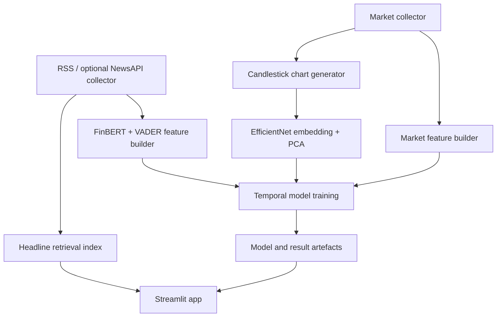

# Architecture

The predictive research pipeline and the news Q&A interface are separate. The Q&A feature retrieves bundled headlines and only uses an optional external generator when a local environment key is configured. Public demo mode should leave such keys unset.

Data paths and model locations are centralised in `src/config.py`. `src/models/splits.py` holds the date-aware validation splitter. Notebooks are development records and can differ from the revised production-style modules.
